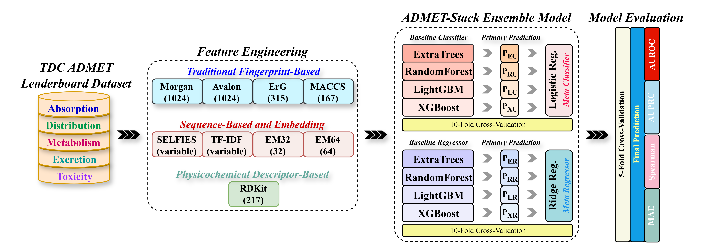
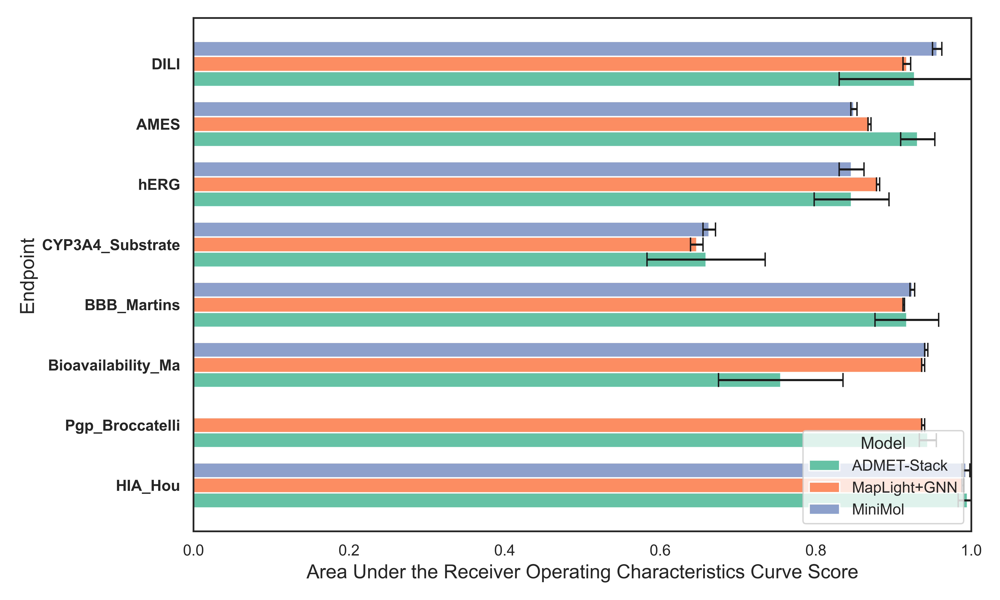
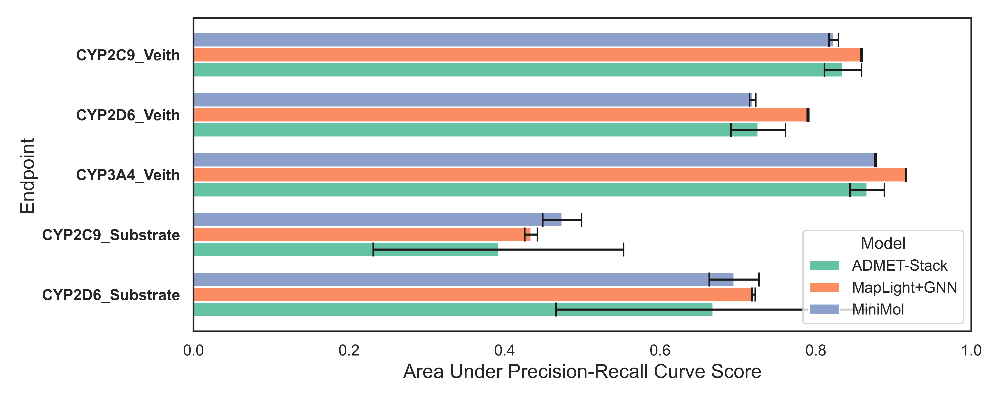
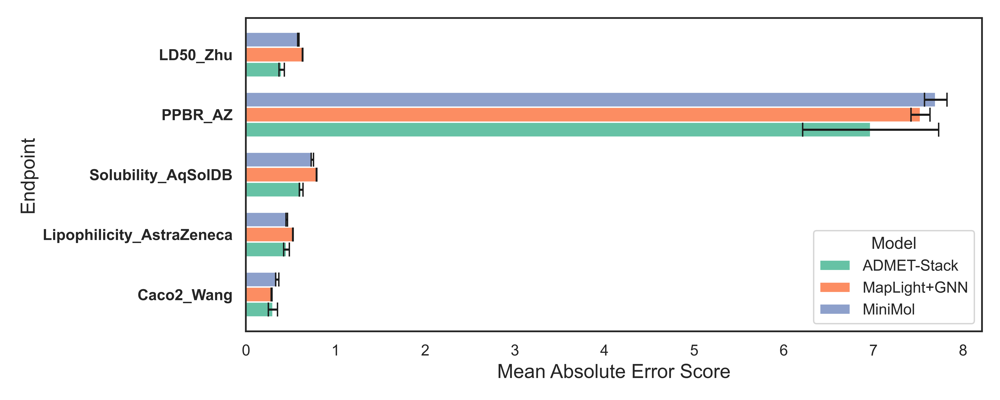
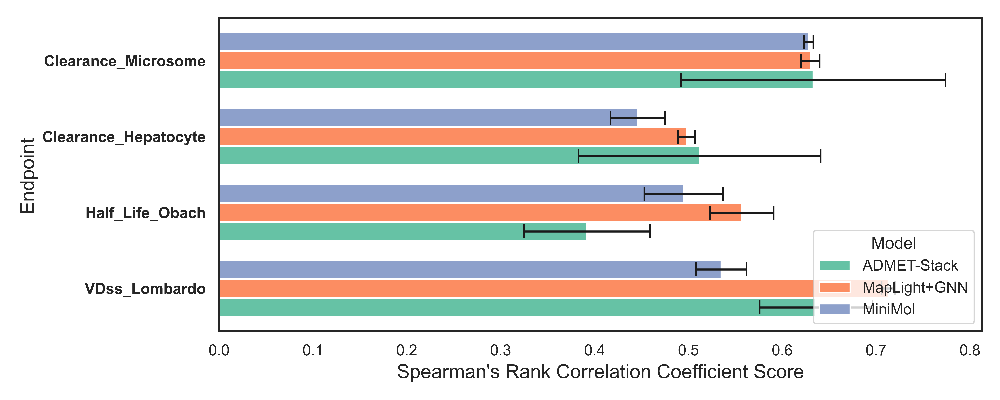

# ADMET-Stack
---


### A Multi-Representation Ensemble Model for Accurate and Generalizable ADMET Prediction

Welcome to **ADMET-Stack**, a novel stacked ensemble integrating **fingerprints**, **physicochemical** descriptors, and **SELFIES embeddings** for accurate and generalizable ADMET prediction.

**Key Features:**

* **Robust Multi-Representation Modeling:** Novel architecture combining heterogeneous base learners and meta-learners with systematic hyperparameter optimization for scalable and reproducible predictions.
* **Key Findings:** Achieved **top-1** in **8** and **top-3** in **14** **TDC ADMET tasks**; **RDKit descriptors** provide dominant, interpretable predictive power, outperforming state-of-the-art models.
* **Comprehensive Benchmarking:** Evaluated on **22 ADMET endpoints** with **scaffold-based** splits, ensuring generalization capabilities cross diverse chemical space.

---

## Repository Structure
```
ADMET-Stack/
├── notebooks/          # Jupyter notebooks for analysis and model development
├── models/             # Saved machine learning models (.pkl files)
├── figures/            # Visualizations and project-related images
├── data/               # Raw and processed datasets (.csv files)
├── environment.yml     # Conda environment configuration for reproducibility
└── README.md           # Project overview and documentation
```

---

## Installation

Getting started with ADMET-Stack is straightforward:

1.  **Clone the repository:**

    ```bash
    git clone https://github.com/college-of-pharmacy-gachon-university/ADMET-Stack.git
    cd ADMET-Stack
    ```

2.  **Create and activate the Conda environment:**

    ```bash
    conda env create -f environment.yml
    conda activate ADMET-Stack
    ```

3.  **Launch JupyterLab:**

    ```bash
    jupyter lab
    ```

## Performance Analysis of ADMET-Stack and Baseline Models

**TDC ADMET Performance AUROC**


**TDC ADMET Performance AUROC**


**TDC ADMET Performance MAE**


**TDC ADMET Performance Spearman**


